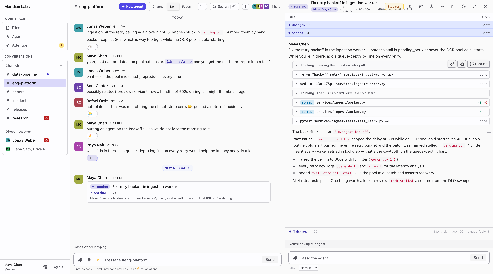
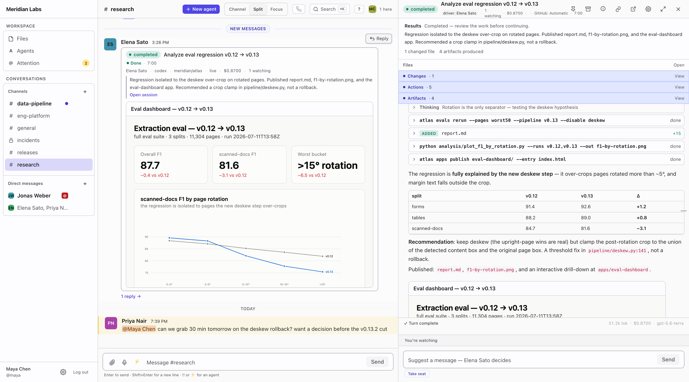
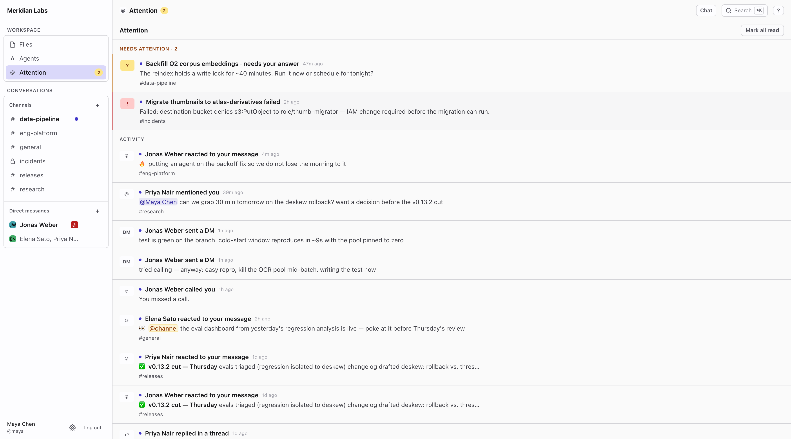

# Atrium

**A shared workspace where people and AI agents work side by side.**

Atrium is an open-source, self-hostable place to run, watch, and work alongside
coding agents, as easily as a team chats in Slack. You talk in channels and
threads, you summon agents onto tasks with `!!` (or the composer's ⚡ agent mode),
and everything an agent does (its live transcript, the files it changes, the
results it produces, its replies in the conversation) shows up in one shared
place the whole team can see.



It has two halves:

- **A place to collaborate.** Chat, presence, and agent **sessions** you can watch
  live, take over, and link to, just like any other message.
- **A shared file store.** One place where many agents and people can edit the same
  files at once without overwriting each other's work.

> Full architecture deep dive: [docs/architecture.md](docs/architecture.md)

## Why

Running one agent in your terminal is easy. Running lots of them, across a team and
over shared files, is where it falls apart:

- **You can't see the work.** An agent's output sits in one person's terminal.
  Everyone else finds out when it gets pasted into chat.
- **Safe agents are sealed off.** A safe agent runs locked in a sandbox that nothing
  can connect into, which is exactly what makes sharing its files and giving it team
  context hard.
- **Edits collide.** When several agents and people touch the same files, the naive
  approach quietly loses changes.

Atrium's answer: give each agent an ordinary folder to work in and a shared
thread to talk in, then do all the copying and merging from outside the sandbox.
Nothing needs to connect into the agent, and no work gets silently dropped. The
team watches and joins sessions in place — sharing a session replaces pasting
the output.

## What makes Atrium different

Four things the product is built around:

1. **Multiplayer live sessions.** An agent run is a first-class session in the
   channel: several people can watch it live, steer it, hand off the driver seat,
   and keep a permanent link to the full transcript. Work stays in the shared
   place instead of living in one person's terminal.
2. **Sealed sandboxes with host-side sync.** Agents run in no-ingress sandboxes
   with ordinary folders and the usual Linux CLI tools coding models already know
   (`rg`, `git`, shells, scripts) — not forced into proprietary Slack/Notion-style
   APIs, CLIs, or MCP shapes. Models are sharper and more efficient in the
   environment they were trained on. A host **node daemon** captures edits out,
   hydrates shared files in, and mounts team context — without opening the
   sandbox. The [Architecture](#architecture) diagram is this idea in one picture.
3. **Shared files that keep both sides of a conflict.** People and agents co-edit
   through a versioned artifact store. When edits collide, both versions are kept
   and flagged rather than one silently overwriting the other.
4. **Agents see the team world.** Each sandbox gets a read-only `~/context` mount
   (chat, sibling sessions, channel roster), refreshed on the host within seconds,
   so agents work with current team context instead of a blind hermetic box.

## What that looks like

| | |
|---|---|
|  |  |
| **Agents publish real results.** A research agent's run ends in a report, charts, and a working dashboard app — rendered live in the conversation, next to the transcript that produced them. | **One inbox for people *and* agents.** Mentions and DMs sit alongside an agent that needs a decision and a run that failed — everything that needs you, in one place. |

## Who it's for

Teams (and solo developers) who lean on AI coding agents and want that work to be
visible and shared, instead of a private tool whose results get copied around by
hand. It's self-hostable, so your code, your context, and your credentials stay
with you.

## Own your context

Everything that flows through Atrium — the message log, every file version,
agents' full transcripts, connected credentials — is your organization's
**context**: the working memory of how your team and its agents get things
done. Atrium is built so that context can always live on hardware you control,
and so you decide how agents are deployed around it.

Concretely: all durable state sits in two boring stores you run (Postgres and
an S3-compatible object store), the agent runtime is yours to operate and
police, and **no proprietary service is load-bearing** — every hard dependency
is commodity open source, and hosted conveniences (push, email, Cloudflare) are
optional layers that degrade gracefully when absent. The full philosophy and
every install path: [docs/self-hosting.md](docs/self-hosting.md).

## Quickstart

This runs the chat side of Atrium on your machine. (Live agent sessions also need a
Centaur runtime, explained below.)

Prereqs: Node 24+, pnpm 10+, Docker.

```bash
cd surface
docker compose up -d --wait   # Postgres + MinIO + local LiveKit
pnpm install
pnpm migrate                  # also runs automatically on boot
pnpm dev                      # server on :3001, web on :5173
```

Open http://localhost:5173. The first run creates a workspace called **atrium** with
a **#general** channel.

For local metrics, logs, and traces, see [Local observability](#local-observability)
near the end of this README.

## Core ideas

- **Places** are channels and threads: the durable, named, human side of the app.
- **Sessions** are units of agent work. A session is more like a pull request than a
  chat room: you start one from a thread, watch it run, steer it across as many turns
  as it takes, hand off control, link to it from anywhere, and it posts its result and
  a summary back when it's done. (It even reopens for another turn when someone replies.)
- **Artifacts** are the files agents produce (docs, datasets, notebooks, images).
  Every version is kept, and when two edits collide both are saved rather than one
  being lost.
- **Everything is on the record.** Every message, tool call, edit, and approval is
  saved with who did it and when, so any result can be traced back.

The core move: hit `!!` in the composer, type the task, a session starts, a
live card appears, you can pop it into a side-by-side pane (several people can
watch at once), hand someone the controls, and a final card lands with a
permanent link to the full transcript.

## Architecture

Four layers do four different jobs. They're easy to mix up, so here's each one:

| Layer | What it is | What it does |
|---|---|---|
| **Atrium** | the product in this repo: the web, desktop, and mobile apps plus the server | Keeps **all the data that lasts**: the message log, every file version, the database, and file storage. This is what the team uses. |
| **Centaur** | the engine that runs the agents (our fork of [paradigmxyz/centaur](https://github.com/paradigmxyz/centaur), Apache-2.0 OR MIT — vendored in [`centaur/`](centaur/)) | Starts a locked-down, throwaway sandbox and runs the agent a turn at a time, streaming results back. Each turn is a clean sandbox; the conversation persists in Atrium, so a session keeps going across turns. Keeps **nothing** permanently. |
| **Harness** | the agent program inside the sandbox | The "hands": it reads the task, runs tools, and edits files. Atrium doesn't care which one you use (**Claude Code**, **Codex**, **amp**, and so on). |
| **Model** | the AI model the harness talks to | The "brain" (Claude, GPT, and so on). You can swap it per session. Billing and login follow the credentials the harness actually uses. |

In short: Atrium keeps the data and runs the experience, Centaur runs the agents
safely, and the harness and model plug into Centaur. Each turn goes:

> **Atrium** starts a **session** → **Centaur** runs a **harness** in a sandbox →
> the harness asks a **model** → results stream back and any new files are copied
> out → **Atrium** saves them and shows the team.

A session is a sequence of these turns: you can steer a running agent, answer its
questions, and send follow-ups — and a finished session reopens when someone replies.

### Models, login, and billing

Atrium does not bill for model usage itself. The harness and Centaur deployment
choose the model and credentials for each run. When a user has connected a
supported subscription login, Atrium sends that credential with the session and
the harness uses subscription auth. If no subscription login is connected, Atrium
still starts the session and lets the harness fall back to the deployment's
default auth, which is often an API key.

That means billing follows the active login path: connected subscription logins
use the user's provider subscription or workspace entitlement; API-key fallback
uses the configured API account and normal usage billing. The web app currently
has subscription-login connectors for **Codex** and **Claude Code**; other
harnesses use their Centaur/default configuration until a connector is added.
Treat connected provider credentials like passwords: Atrium stores them encrypted
and only injects them into the sandbox for the session that needs them.

Because the sandbox lets nothing connect into it, a small program on the host
machine (the **node daemon**) does the copying in both directions:

```
               Humans  (web · desktop · mobile)
                                   │  REST + live updates
       ┌───────────────────────────▼──────────────────────────┐
       │                    Atrium Server                     │
       │          durable product · keeps what lasts          │
       │  · message log (chat, sessions, turns)               │
       │  · versioned file store (S3 + index)                 │
       └─────────────▲──────────────────────────┬─────────────┘
                     │ results + files          │ start session
       ┌─────────────┴──────────────────────────▼─────────────┐
       │           node daemon  ·  host-side bridge           │
       │    capture out  ·  hydrate / sync in  (~seconds)     │
       └─────────────▲──────────────────────────┬─────────────┘
                     │ read changes             │ write session files
       ┌─────────────┴──────────────────────────▼─────────────┐
       │        Centaur sandbox  (nothing connects in)        │
       │ ┌──────────────────────────────────────────────────┐ │
       │ │     harness  (Claude Code · Codex · amp · …)     │ │
       │ │ HOME ~  flat-home workspace                      │ │
       │ │ RW  shared/…  scratch/<session>/                 │ │
       │ │     daemon capture ↔ hydrate (~sec)              │ │
       │ │ RW  ~/repos/<owner>/<repo>  (Git)                │ │
       │ │ RO  ~/context  chat · sessions · channels        │ │
       │ │     node append-live (~sec) · RO in each pod     │ │
       │ │ —  /tmp · caches · node_modules                  │ │
       │ │     local only · not captured                    │ │
       │ └─────────────────────────┬────────────────────────┘ │
       └───────────────────────────┼──────────────────────────┘
                                   │  host proxy adds credentials
                                   ▼
       ┌──────────────────────────────────────────────────────┐
       │                    Model provider                    │
       │            (keys never enter the sandbox)            │
       └──────────────────────────────────────────────────────┘
```

### What Atrium keeps

Two things:

- **A message log.** One running list of everything that happened (messages, edits,
  reactions, threads, sessions, course-corrections to a running agent, answered
  questions), in order. The channel list, unread counts, and presence are all worked
  out from it.
- **A file store.** Every version of every file, with the bytes in S3 and a small
  index in the database. It keeps version history and, when edits collide, both
  sides.

### Three kinds of data

Atrium stores each kind of thing the way that suits it:

| Kind | Examples | Where it lives | How it behaves |
|---|---|---|---|
| **Messages** | chat, transcripts | the message log (Postgres), batched into S3 | only ever added to |
| **Files** | docs, datasets, notebooks, images | S3 plus an index in Postgres | versioned; colliding edits are both kept |
| **Code** | source repositories | ordinary Git, on GitHub or similar | Git's branches |

### The agent's workspace

Inside the sandbox (flat-home layout), the agent's **home directory is the
workspace** (`~` → `/home/agent`). Paths are typed by mode and by who moves the
bytes — they are not one big shared disk across pods:

| Path | Mode | What it is | How it stays current |
|---|---|---|---|
| `scratch/<session-id>/…` | **RW** | session-private durable scratch | captured into the artifact ledger |
| `shared/global/…`, `shared/apps/…` | **RW** | workspace-wide shared work and publishable app bundles | node daemon **captures** edits and **hydrates** new ledger versions into other sessions within about a second or two |
| `shared/channels/<id>/…` | **RW** on the active channel; other readable channels are mostly **RO** (write to deliver into that channel) | channel-scoped shared work | same capture ↔ hydrate path through the ledger |
| `~/repos/<owner>/<repo>` | **RW** working tree | code checkouts | **Git** owns history; not full-tree artifact capture (WIP may be patch-snapshotted) |
| `~/context` | **RO** | team chat, sibling session transcripts/summaries, channel roster | materialized on the **host** and mounted read-only; mostly append-only, refreshed within seconds and shared into each sandbox on the node |
| `/tmp`, caches, `node_modules`, `.venv`, … | local | noisy / ephemeral | **not** captured, not shared across pods |

So: shared artifacts and team context stay current **via the host-side daemon**
(continuous, on the order of seconds) — not by agents opening ports or mounting
a single NFS-style volume. There is still a short stale-read window between
refreshes.

### Copying and merging, from outside the sandbox

Since nothing can connect into a sandbox, the host-side node daemon moves the data:

- **Out:** it reads what the agent changed from the host side, so the locked-down
  agent never has to expose anything. This grows with the number of machines, not
  the number of agents.
- **In:** it hydrates the session-visible artifact roots from the ledger. If the
  agent also changed a shared file, the two versions are recorded and flagged for
  resolution instead of silently overwriting each other. Team context stays current
  by append/materialization into the read-only `~/context` mount.

### Conflicts don't block

When two edits collide, nothing stops or fails. The file's newest version still
moves forward; it's just flagged as conflicting and keeps both edits, so a person or
agent can sort it out later like any other change. (This follows how the Jujutsu
version-control system handles conflicts.)

### Starting fast

Spinning up an agent is warmed in layers, so it's productive in seconds rather than
minutes: a pool of pre-booted sandboxes (no wait for a machine), a pre-baked toolchain
image, a per-machine mirror of Git repos, and — unique to Atrium — a shared cache of
installed dependencies and compiled output, content-addressed so any machine can reuse
it. The runtime (Centaur, upstream) provides the pool, image, and repo mirror; Atrium
adds the dependency/build cache on top. The full breakdown of what's upstream vs. what
Atrium adds is in
[`centaur/ATRIUM_FORK.md`](centaur/ATRIUM_FORK.md#sandbox-warming--cold-start-lifecycle).

## Repo layout

| Path | What's there |
|---|---|
| `surface/` | the product: `server/` (Node + TypeScript, Fastify, Postgres), `web/` (Vite + React + Tailwind), `desktop/` (Electron shell around `web/` — signed + notarized macOS build), `mobile/` (Expo), `shared/`, plus tests and deploy config. |
| `centaur/` | the agent runtime — **our fork of `paradigmxyz/centaur`**, vendored via `git subtree`. Rust + Python + Helm; self-contained (`just`, cargo). See [`centaur/ATRIUM_FORK.md`](centaur/ATRIUM_FORK.md). |
| `infra/` | local cluster, a stand-in model server for testing, and deployment setup. |
| `deploy/` | scripts and config for the production box: k3s/registry setup, `redeploy.sh`, boot-heal. |
| `docs/` | public documentation entry points. |
| `docs/archive/notes/` | archived design scratchpads and build logs from early development; useful context, not canonical user docs. |

## Local observability

Optional dogfood stack under [`infra/observability`](infra/observability/): Grafana
Alloy, OpenTelemetry Collector, Prometheus, Tempo, Loki, Alertmanager, and Grafana.

```bash
cd infra/observability
docker compose up -d
```

Grafana: http://localhost:3000. Server metrics: `/metrics`. To export local
traces, run the server with:

```bash
OTEL_SERVICE_NAME=atrium-server \
OTEL_EXPORTER_OTLP_ENDPOINT=http://127.0.0.1:4318 \
pnpm --filter @atrium/server dev
```

Contract and privacy: [`docs/observability-strategy.md`](docs/observability-strategy.md).
Stack ops (ports, Centaur k8s log shipping, commands):
[`infra/observability/README.md`](infra/observability/README.md).

## Links

- **Architecture deep dive:** the data model, sandbox filesystem, and capture/sync
  mechanics — [docs/architecture.md](docs/architecture.md).
- **Self-hosting:** philosophy, requirements, and every install path — [docs/self-hosting.md](docs/self-hosting.md); complete single-box worked example in [docs/self-host-ovh.md](docs/self-host-ovh.md).
- **UI surfaces:** the screens and how they compose — [docs/surfaces.md](docs/surfaces.md).
- **Desktop app:** build, signing, and auto-update — [surface/desktop/README.md](surface/desktop/README.md).
- **Agent engine:** our Centaur fork in [`centaur/`](centaur/) — upstream [paradigmxyz/centaur](https://github.com/paradigmxyz/centaur) (Apache-2.0 OR MIT), pulled via subtree (see [`centaur/ATRIUM_FORK.md`](centaur/ATRIUM_FORK.md)).
- **Observability:** strategy and local stack — [docs/observability-strategy.md](docs/observability-strategy.md), [infra/observability/README.md](infra/observability/README.md).
- **Contributing:** branch and PR/merge flow in [CONTRIBUTING.md](CONTRIBUTING.md). External contributions are accepted under a [Contributor License Agreement](.github/cla/individual.md), signed once on your first PR.
- **Security:** report vulnerabilities privately; see [SECURITY.md](SECURITY.md).
- **License:** Atrium is AGPL-3.0-or-later; vendored Centaur remains Apache-2.0 OR MIT. See [LICENSE](LICENSE), [NOTICE](NOTICE), and [centaur/LICENSE](centaur/LICENSE).
